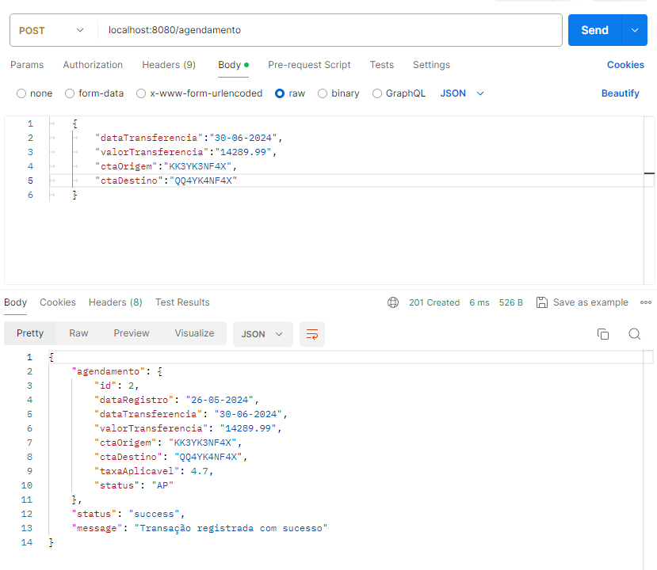
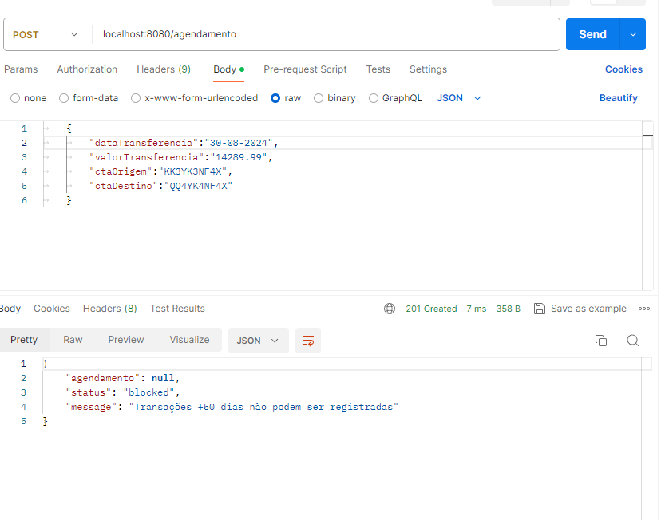
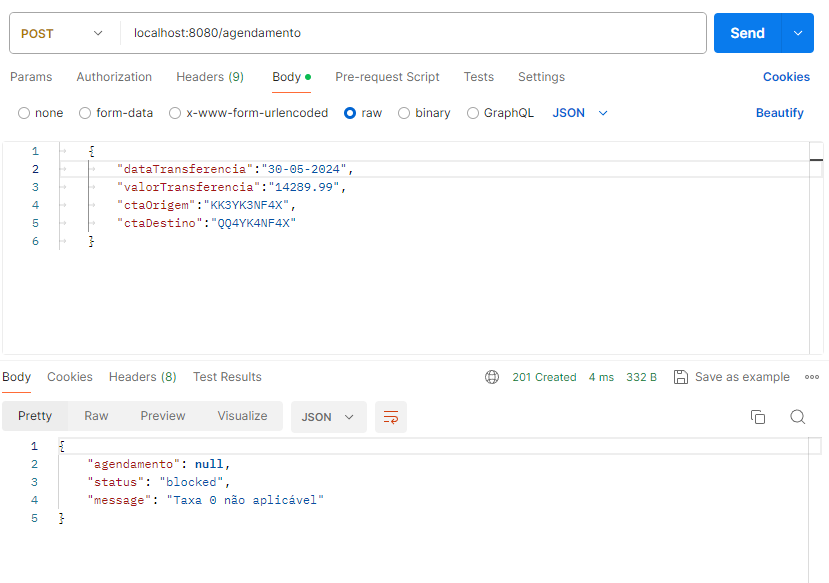
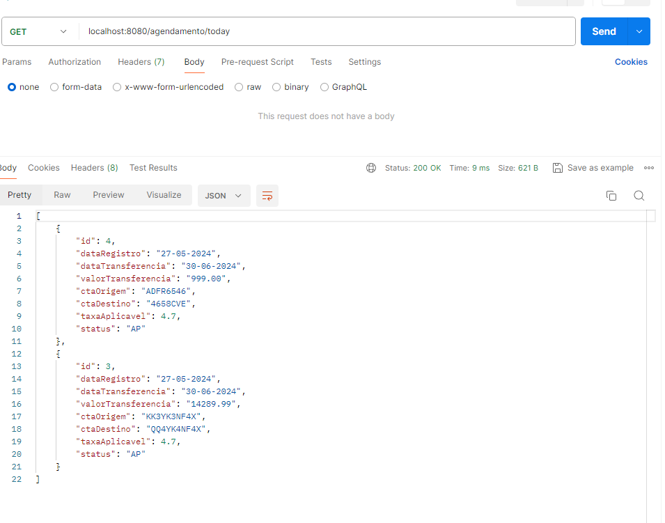
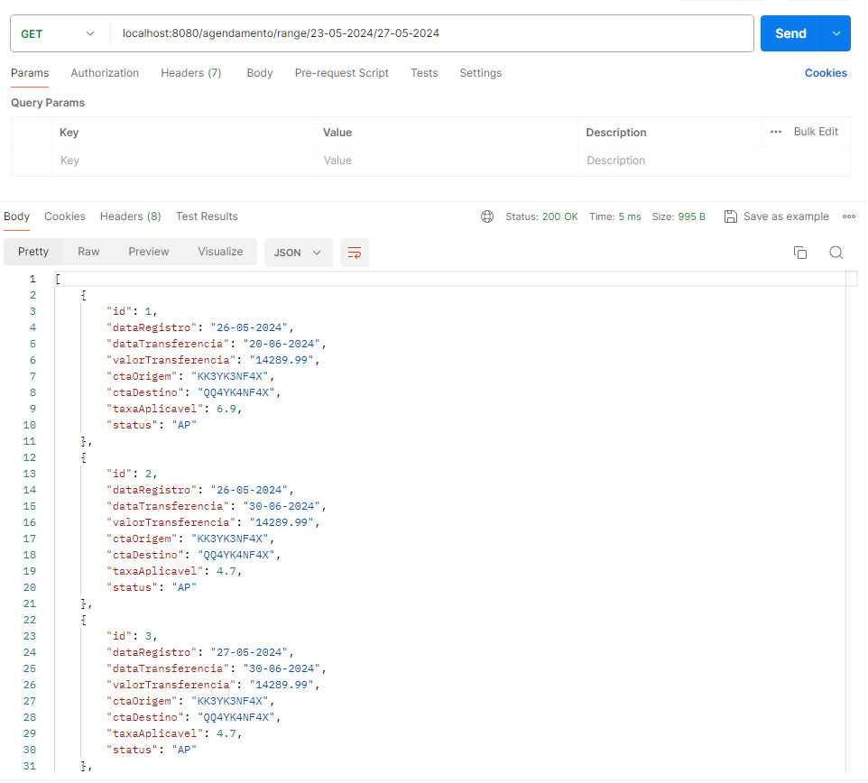

# Agendador de transferências
Este é um backend de um sistema agendador de transferências bancárias, que recebe as requisições via rest e faz a persistencia dos dados em memória com H2 database.


## 🛠 Tecnologias
- Java 11
- SpringBoot 2.7.18
- SpringData JPA
- H2 database 2.2.220
- Lombook
- Arquitetura Hexagonal
- FrontEnd https://github.com/V1centR/AgendadorTransferenciasVue


## Instalação

Faça o clone do repositório e dentro da pasta AgendadorTransferenciasBackEnd execute o comando:

```bash
  mvn install
```

Após terminado a execução do install execute:

```bash
  mvn spring-boot:run
```

[](https://www.linkedin.com/in/vicent-ramos-33954ab5/)


## Screenshots









